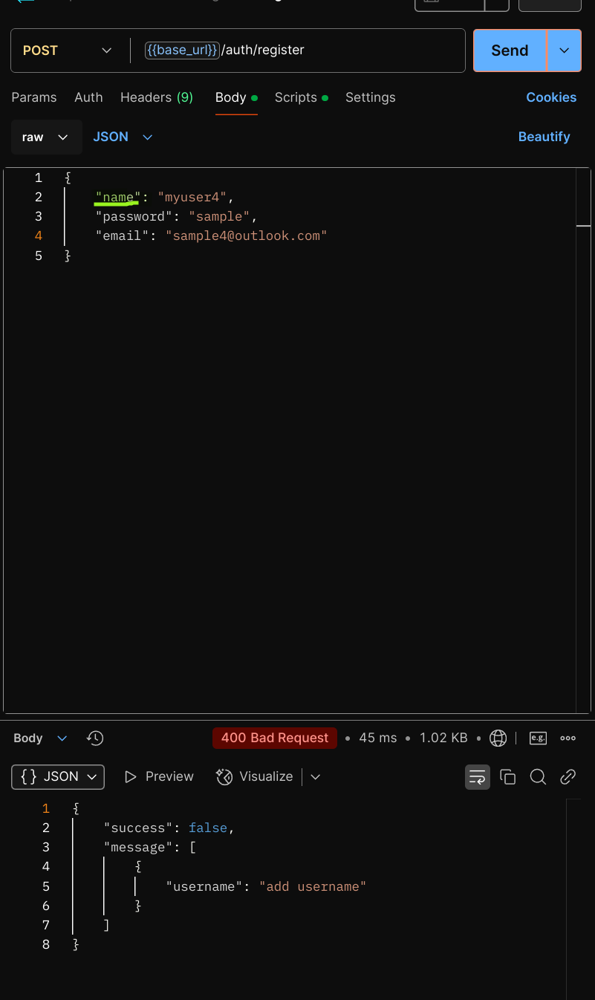

# Let's connect a database - MongoDB Intro

## Overview

It is time to talk to a Database.

## Requirements

Start from the repo you cloned and worked on from previous class [simple-auth-service](https://github.com/juan-instructor/simple-auth-service)

> [!IMPORTANT]
> After testing your API, make sure your `frontend` can now send requests to your backend and save users in your database.

### After reviewing MongoDB and Mongoose

Make sure your API now tests and behaves like the following:

`http://localhost:8080/users`

`http://localhost:8080/users?name=<user-name>`

`http://localhost:8080/auth/register`

> [!NOTE]
> bad body request - username not provided

`http://localhost:8080/auth/register`

> [!NOTE]
> bad body request - email not provided

`http://localhost:8080/auth/register`

> [!NOTE]
> email already in database

`http://localhost:8080/auth/register`

> [!NOTE]
> username already in database

`http://localhost:8080/auth/register`

> [!NOTE]
> Successful registration

`http://localhost:8080/auth/register`

> [!NOTE]
> Log-in

`http://localhost:8080/auth/login`

> [!NOTE]
> Log-in

`http://localhost:8080/auth/login`

> [!NOTE]
> Access a protected route with **_BAD_** token

`http://localhost:8080/recipes`

> [!NOTE]
> Finally, I am able to access the protected route with a valid token taken from the `/auth/login` route.

`http://localhost:8080/recipes`

